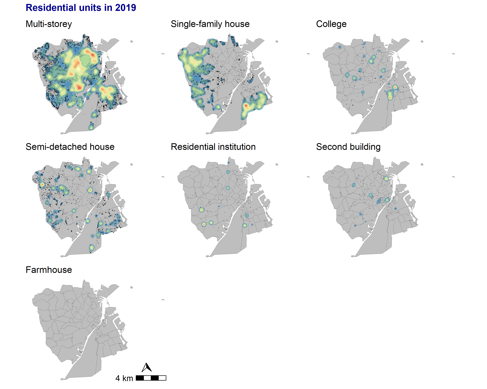

# (PART) Data analysis {-}

# Spatial distribution of residential units

Create a function for ploting 2D kernel density maps:
```{r aux-funct-2d-runits}
  
  f <- function(.data) {
    .data %>% 
      st_coordinates() %>%
      as_tibble() %>%
      ggplot() +
      geom_sf(data = cph_parish, fill = "grey", color = "grey50", size = 0.05) +
      geom_point(aes(X, Y), size = 0.02, shape = 16) +
      stat_density_2d(aes(X, Y, fill = ..level..),
                      alpha = 0.5,
                      h = 700,
                      geom = "polygon") +
      scale_fill_distiller(palette = "Spectral")  +
      theme_void() + 
      theme(legend.position = "none") +
      labs(title = .data$type,
           x = "",
           y = "") 
  }

```

Plot of spatial distribution of residential units by type of use in 2019:
```{r runits-spat-dist, fig.show='hide', cache = TRUE, dependson = "load-BBR"}

  p <- res_units %>% 
    filter(BBR_year == 2019) %>%  
    group_split(type) %>%
    map( ~ f(.))
  
  wrap_plots(p) +
    annotation_scale(location = "br", text_cex = 1) +
    annotation_north_arrow(location = "br",
                           pad_x = unit(1.00, "cm"),
                           pad_y = unit(0.65, "cm"),
                           which_north = "true",
                           height = unit(0.5, "cm"),
                           width = unit(0.5, "cm"),
                           style = north_arrow_orienteering(text_col = "white",
                                                            text_size = 1)) +
    plot_annotation(title = "Residential units in 2019",
                    theme = theme(plot.title = element_text(size = 14,
                                                            colour = "darkblue",
                                                            face = "bold"),
                                  plot.caption = element_text(size = 9,
                                                              colour = "grey25")
                    )
    ) 
  
  ggsave(filename = "results/Kernel_maps_builds_type_2021.png",
         width = 25,
         height = 20,
         units = "cm")
                    
```
 
```{r fig-sp-res-builds, out.width = '100%', fig.align = "center", fig.cap = "2D kernel density map"}



```
