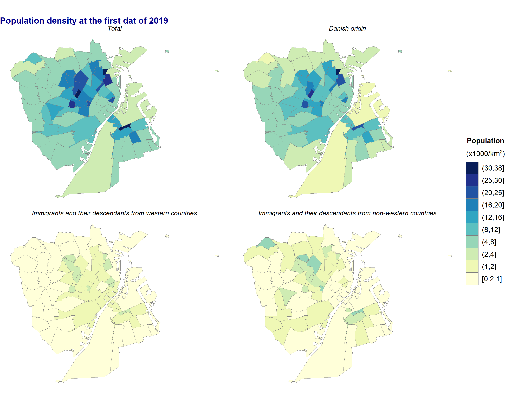
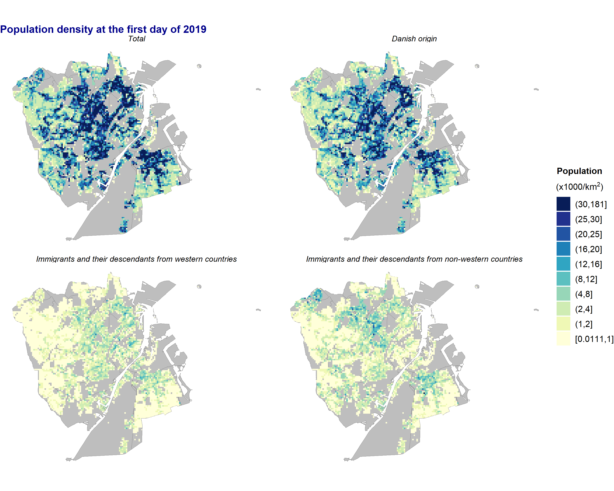
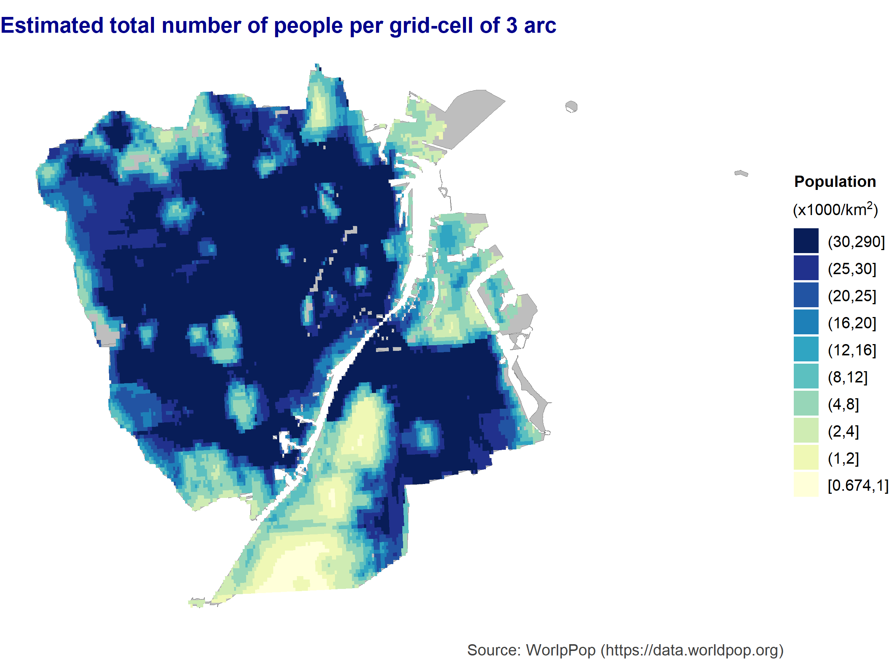
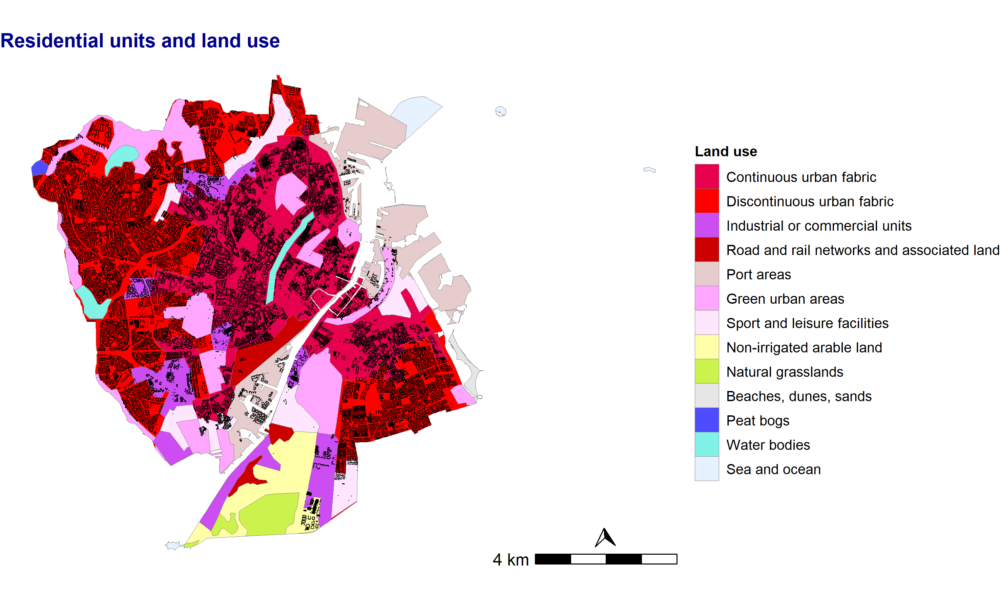

# Population density 

BBR data represent the situation at the begining of the given year. Therefore, when we link the BBR data with the population data, which also represent the situation at the first day of the year, we use the population of the same year (e.g. BBR data from 2019 and population data from 2019).

## Choropleth by ancestry

Plot population density at the last day of 2019 (first of 2010) by parish and ancestry.
```{r pop-chor, fig.show='hide'}

  col <- brewer.pal(9, "YlGnBu")
  pal <- colorRampPalette(col)
  my_pallette <- pal(10)
  
  pop_dens_choropleth <-  prsh_pop_sf %>% 
    select(prsh_id, prsh_name, prsh_area_km2, date, 
           pop_total, pop_dan, pop_frgn_wst, pop_frgn_nwst) %>% 
    filter(date == 2019) %>%
    # Calulate population density (pop/area)
    mutate(across(starts_with("pop_"), ~ . / (1000 * prsh_area_km2))) %>% 
    rename_with(~paste(.x, "km2", sep = "_"), starts_with("pop")) %>% 
    as_tibble() %>% 
    pivot_longer(starts_with("pop_")) %>% 
    st_as_sf() %>% 
    mutate(name = factor(name, 
                         levels = c("pop_total_km2", 
                                    "pop_dan_km2",
                                    "pop_frgn_wst_km2",
                                    "pop_frgn_nwst_km2"),
                         labels = c("Total",
                                    "Danish origin",
                                    "Immigrants and their descendants from western countries",
                                    "Immigrants and their descendants from non-western countries")))
  
  brks_c <- c(min(pop_dens_choropleth$value),
              1, 2, 4, 8, 12, 16, 20, 25, 30,
              ceiling(max(pop_dens_choropleth$value)))
  
  pop_dens_choropleth  %>% 
    ggplot() +
    geom_sf(aes(fill = cut(value, breaks = brks_c, include.lowest = T)),
            color = "grey50",
            size = 0.05) +
    scale_fill_manual(name = TeX("$\\overset{\\textbf{Population}}{(x1000/km^2)}$"),
                      values = my_pallette,
                      drop = FALSE,
                      guide = guide_legend(reverse=TRUE))  +
    my_theme_map() + 
    theme(plot.title = element_text(size = 12, colour = "darkblue", face = "bold"),
          strip.text = element_text(size = 9, color = "black", face = "italic")) +
    labs(title = "Population density at the first dat of 2019",
         x = "",
         y = "") +
    facet_wrap( ~ name)
  
  ggsave(filename = "results/pop_density_2019_choropleth.png",
         width = 25,
         height = 20,
         units = "cm")
  
```

```{r fig-pop-map-chor, out.width = '100%', fig.align = "center", fig.cap = "Population density by parish (choropleth)"}



```

## Disaggregating population data

We disaggregate the population data at Parish level to grid cells of 100m x 100m using residential buildings as ancillary data. The procedure is as follow: 

1. We calculate the occupancy rate (*OR*) for the residential units of each parish (*j*): $$OR_{j} = \frac{pop_{j}}{N_{j}}$$

1. We make grid cells of 100m x 100m over the study area

1. We select only the grids with residential units 

1. Detect to what parish (*j*) belong each grid (*i*). (Note that one grids may be in more that one parish)

1. Calculate the number of dwellings per grid and parish ($N_{ij}$)

1. Estimate the population in each grid (*i*) base the occupancy rate by parish (*j*): $$pop_{gi} = \sum_{j = 1}^{n}(OR_{j} \cdot N_{ij})$$

1. Population density: $$PD_{i} = \frac{pop_{i}}{A_{i}}$$

Therefore we create the following function:
```{r aux-funct-pop-den}

#' Calculate the population density in the grids created by f_grids 
#' @param .pop        POLYGONS with the population data (i.e. prsh_pop_sf)
#' @param .parish     POLYGONS where the number of units will be calculated 
#' @param .res_points POINTS with the residential units (e.g. res_units) 
#' @param .grids      Grid cells generated by f_grids
#' @param .year       Year of the analysis

  f_pd_grids <- function(.pop, .parish, .res_points, .grids, .year) {
    
    # Population at the last day of the year (.year)
    pop_year <- .pop %>%
      # Select population data at the first day of the quarter 
      select(prsh_id, prsh_name, prsh_area_km2, date, 
             pop_total, pop_dan, pop_frgn_wst, pop_frgn_nwst) %>% 
      # select the data at the end of the year (first dat of the next year) 
      filter(date == (.year))
    
    # BBR of the selected year (represent the last day of the year)
    BBR_year <- filter(.res_points, BBR_year == .year) 
    
    # Calculate occupancy rate ("OR") of the residential units in each parish in a year
    OR <- pop_year %>%  
      # number of units per parish
      mutate(n_units = st_intersects(., BBR_year, dist = 10) %>%
               map(., ~length(.)) %>%
               unlist()) %>% 
      # mean population per unit in each parish
      mutate(across(starts_with("pop"), ~ . / n_units)) %>% 
      rename_with(~paste(.x, "or", sep = "_"), starts_with("pop")) %>% 
      # output as table 
      as_tibble() %>% 
      select(-n_units, -geometry)
    
    # Get only the grids with residential units on them
    gru <- .grids %>% 
      # Number of residential units per grid
      mutate(n_units = st_intersects(., BBR_year , dist = 10) %>%
               map(., ~length(.)) %>%
               unlist()) %>% 
      # Get grids with residential buildings
      filter(n_units > 0) %>%
      # Detect to what parish belong the grid
      st_intersection(., .parish ) %>% 
      # Remove parish area
      select(-prsh_area_km2, -SOGNENAVN) %>% 
      # convert to table
      as_tibble()
  
    # Population density by grids
    gru %>% 
      # Merge OR per parish  
      left_join(OR, by = c("SOGNEKODE" = "prsh_id")) %>% 
      st_sf() %>% 
      # recalculate population by grid 
      mutate(across(starts_with("pop"), ~ . * n_units)) %>% 
      rename_with(~gsub("_or", "", .), .col = starts_with("pop")) %>% 
      # sum population of each parish of the grid
      group_by(grid_ID) %>% 
      summarise(pop_total = sum(pop_total),
                pop_dan = sum(pop_dan),
                pop_frgn_wst = sum(pop_frgn_wst),
                pop_frgn_nwst = sum(pop_frgn_nwst),
                n_units = sum(n_units)) %>% 
      ungroup() %>% 
      # Area of the grid
      mutate(area_km2 = as.numeric(units::set_units(st_area(.), km^2))) %>% 
      # Population density (pop/area)
      mutate(across(starts_with("pop_"), ~ . / (1000 * area_km2))) %>% 
      rename_with(~paste(.x, "km2", sep = "_"), starts_with("pop")) %>% 
      # Pivot longer
      as_tibble() %>% 
      pivot_longer(starts_with("pop_")) %>% 
      st_as_sf() %>% 
      # Remove polygons with 0 population
      filter(value > 0)
  }

```

Population in 2019 (at the first dat of the year) by grid cells of 100m x 100m and ancestry.
```{r pop-den-grids, fig.show='hide', cache = TRUE, dependson = "adm-units"}

  pop_2019_g100m <-  f_pd_grids(.pop = prsh_pop_sf,
                                .parish = cph_parish,
                                .res_points = res_units,
                                .grids = grids100m,
                                .year = 2019)

  brks <- c(min(pop_2019_g100m$value),
            1, 2, 4, 8, 12, 16, 20, 25, 30,
            ceiling(max(pop_2019_g100m$value)))
  
  pop_2019_g100m %>%
    mutate(name = factor(name, 
                         levels = c("pop_total_km2", 
                                    "pop_dan_km2",
                                    "pop_frgn_wst_km2",
                                    "pop_frgn_nwst_km2"),
                         labels = c("Total",
                                    "Danish origin",
                                    "Immigrants and their descendants from western countries",
                                    "Immigrants and their descendants from non-western countries"))) %>% 
    ggplot() +
    geom_sf(data = cph_parish, fill = "grey", color = "grey50", size = 0.05) +
    geom_sf(aes(fill = cut(value,
                           breaks = brks,
                           include.lowest = T)),
            color = NA) +
    scale_fill_manual(name = TeX("$\\overset{\\textbf{Population}}{(x1000/km^2)}$"),
                      values = my_pallette,
                      drop = FALSE,
                      guide = guide_legend(reverse = TRUE))  +
    my_theme_map() + 
    theme(plot.title = element_text(size = 12, colour = "darkblue", face = "bold"),
          strip.text = element_text(size = 9, color = "black", face = "italic")) +
    labs(title = "Population density at the first day of 2019",
         x = "",
         y = "") +
    facet_wrap( ~ name)
  
  ggsave(filename = "results/pop_dens_2019_grids_100m.png",
         width = 25,
         height = 20,
         units = "cm")
   
```

```{r fig-pop-map-grid, out.width = '100%', fig.align = "center", fig.cap = "Population density by grid cells of 100m x 100m"}



```

## Population density WorldPop    

We can compare our results with the WorldPop total population estimation per grid-cell of 3 arc (approx. gri cells of 100m x 100m):
```{r pop-den-worldpop, fig.show='hide', cache=TRUE, dependson = "adm-units"}

  dnk_ppp_2019_link <- "https://data.worldpop.org/GIS/Population/Global_2000_2020/2019/DNK/dnk_ppp_2019.tif"
  dir.create("data")
  download.file(dnk_ppp_2019_link, "data/dnk_ppp_2019.tif", method = "curl")
  
  library(stars)
  library(tidyverse)
  dnk_ppp_2019 <- read_stars(.x = "data/dnk_ppp_2019.tif",  proxy = TRUE) 
  bbox <-  study_area %>% st_transform(crs = st_crs(dnk_ppp_2019))
  
  cph_ppp_2019 <- st_crop(dnk_ppp_2019, bbox) %>%
    st_transform(crs = "EPSG:25832")
  
  col <- brewer.pal(9, "YlGnBu")
  pal <- colorRampPalette(col)
  my_pallette <- pal(10)
  brks <- c(min(cph_ppp_2019$dnk_ppp_2019.tif, na.rm = TRUE),
            1, 2, 4, 8, 12, 16, 20, 25, 30,
            max(cph_ppp_2019$dnk_ppp_2019.tif, na.rm = TRUE))
  
  cph_ppp_2019 <- cph_ppp_2019 %>% 
    mutate( pop_cuts = cut(dnk_ppp_2019.tif, breaks = brks, include.lowest = T))  
  
  ggplot() + 
    geom_sf(data = cph_parish, fill = "grey", color = "grey50", size = 0.05) +
    geom_stars(data = cph_ppp_2019, aes(fill = pop_cuts)) +
    scale_fill_manual(name = TeX("$\\overset{\\textbf{Population}}{(x1000/km^2)}$"),
                      values = my_pallette,
                      drop = FALSE,
                      guide = guide_legend(reverse=TRUE)) +
    labs(title = "Estimated total number of people per grid-cell of 3 arc",
         caption = "Source: WorlpPop (https://data.worldpop.org)") +
    my_theme_map()
  
  ggsave(filename = "results/pop_dens_2019_worldpop_100m.png",
         width = 20,
         height = 15,
         units = "cm")
  
```

```{r fig-pop-map-worldpop, out.width = '100%', fig.align = "center", fig.cap = "worldpop total population density estimations in 2019"}



```

## Land use and residential units (CORINE) 
 
```{r plot-CORINE, fig.show='hide', cache=TRUE, dependson="load-CORINE"}
  
  ggplot() +
    geom_sf(data = cph_corine,
            aes(fill = label3),
            color = "grey50",
            size = 0.05) +
    geom_sf(data = res_units, size = 0.02, shape = 16) +
    scale_fill_manual(name = "Land use",
                      values = levels(cph_corine$hex_col),
                      drop = TRUE) +
    my_theme_map() +
    labs(title = "Residential units and land use",
         x = "",
         y = "") +
    annotation_scale(location = "br", text_cex = 1) +
    annotation_north_arrow(location = "br",
                           pad_x = unit(1.80, "cm"),
                           pad_y = unit(0.65, "cm"),
                           which_north = "true",
                           height = unit(0.5, "cm"),
                           width = unit(0.5, "cm"),
                           style = north_arrow_orienteering(text_col = "white",
                                                            text_size = 1))

  ggsave(filename = "results/land_use_corine.png",
         width = 25,
         height = 15,
         units = "cm")

```
  
```{r fig-land-use, out.width = '100%', fig.align = "center", fig.cap = "CORINE land use and residential units"}



```
