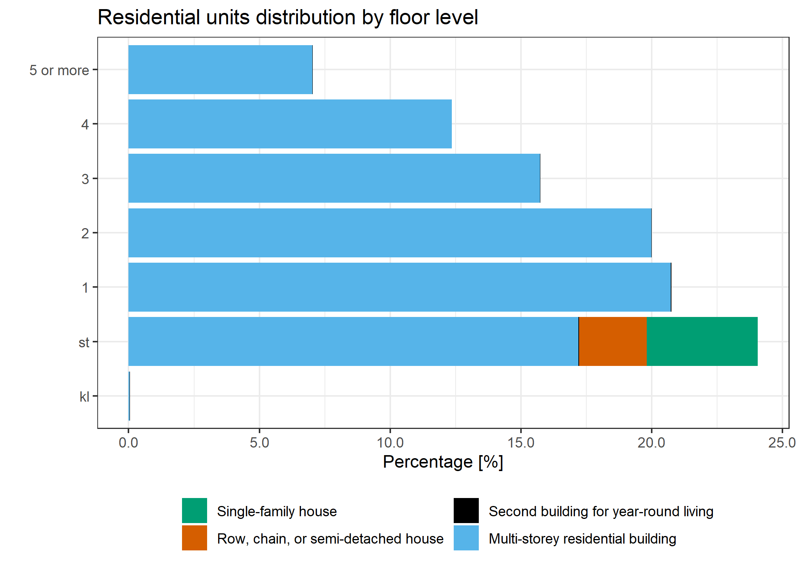

# Residential units saled as free scale

We focused our study in residential dwellings and thus we selected the following building types from the BBS dataset (i.e. *BYG_ANVEND_KODE*):

-   120 - Fritliggende enfamiliehus *(Detached single-family house)*;
-   121 - Sammenbygget enfamiliehus *(Combined single-family house)*;
-   122 - Fritliggende enfamiliehus i tæt-lav bebyggelse (*Detached single-family house in dense-low-rise buildings*);
-   130 - (UDFASES) Række-, kæde-, eller dobbelthus (lodret adskillelse mellem enhederne) *((PHASE OUT) Row, chain, or semi-detached house (vertical separation between the units))*;
-   131 - Række-, kæde- og klyngehus *(Row, chain and cluster housing)*;
-   132 - Dobbelthus *(Semi-detached house)*;
-   140 - Etagebolig-bygning, flerfamiliehus eller to-familiehus *(Multi-storey residential building, multi-family house or two-family house)*;
-   190 - Anden bygning til helårsbeboelse *(Second building for year-round living)*.

Estimate the number of residential units in the study area.
```{r runits-numb}

  res_units %>%
      # Convert to tibble
      as_tibble() %>%
      # Summarize by type or residency and year
      group_by(type, BBR_year) %>% 
      summarise(n = n()) %>% 
      ungroup() %>%
      # Arrange and add row with totals
      arrange(BBR_year, desc(n)) %>%
      # Pivot
      pivot_wider(names_from = BBR_year, values_from = n) %>% 
      adorn_totals("row") %>%
      kbl() %>% 
      kable_paper("hover", full_width = F)

```

Residential units by floor level

- KL - basement
- ST - groundfloor
- 1  - 1st floor
- 2  - 2nd floor
- 3  - 3rd floor
- 4  - 4th floor
- 5 or more = etc.

```{r runits-floor-level, fig.show='hide'}

  res_units %>% 
    as_tibble() %>%
    group_by(floor_level, type) %>% 
    summarise(n = n()) %>%
    ungroup() %>% 
    # in percentage [%]   
    mutate(perc = 100 * n / sum(n)) %>% 
    # Reorder type levels for plotting multi-storey first
    mutate(type = factor(type)) %>%
    ggplot() +
    geom_bar(aes(y = floor_level, x = perc, fill = type), stat = "identity") +
    labs(title = "Residential units distribution by floor level",
         y = "", 
         x = "Percentage [%]") +
    theme_bw() +
    theme(legend.position = "bottom",
          legend.title = element_blank()) +
    guides(fill = guide_legend(ncol = 2)) +
    scale_x_continuous(labels = scales::comma) +
    scale_fill_manual(values = c("#E69F00", "#56B4E9", "#009E73", "#F0E442", "#0072B2", "#D55E00", "#CC79A7"))
  
  ggsave(filename = "results/floor_levels_res_units.png")

```

```{r fig-floor-level, out.width = '100%', fig.align = "center", fig.cap = "Residential units by floor levels"}



```

Dwelling type codes

- 1. Egentlig beboelse                       = Actual residence
- 2. Blandet erhverv og beboelse             = Mixed occupations and housing
- 3. Enkeltværelse                           = Single room
- E. Andet (bl.a. institutioner og erhverv)  = Other (including institutions and professions)

```{r runits-use}

  res_units %>%
    as_tibble() %>%
    group_by(BOLIGTYPE_KODE, type) %>%
    summarise(n = n())

```

Unit area

```{r runits-area-neg}

  res_units %>%
    as_tibble() %>%
    filter(BEBO_ARL < 0)

```

```{r runits-no-area}

  res_units %>%
    as_tibble() %>%
    filter(BEBO_ARL == 0)

```

```{r runits-big-area}

  res_units %>%
    as_tibble() %>%
    filter(BEBO_ARL > 1000) 

```
